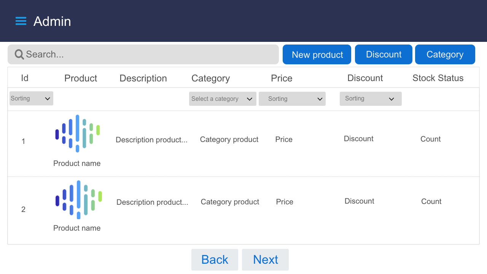

#Docker
run : $ mvn clean package  -> $ mvn spring-boot:build-image ->$ docker-compose up -> docker-compose down

# Scooter-store

# Eureka service

# Zuul Gateway

# Product-info service

# Order and Basket service

# Stock-status

# Scooter-client

# User catalog

# Product page

# Admin catalog

